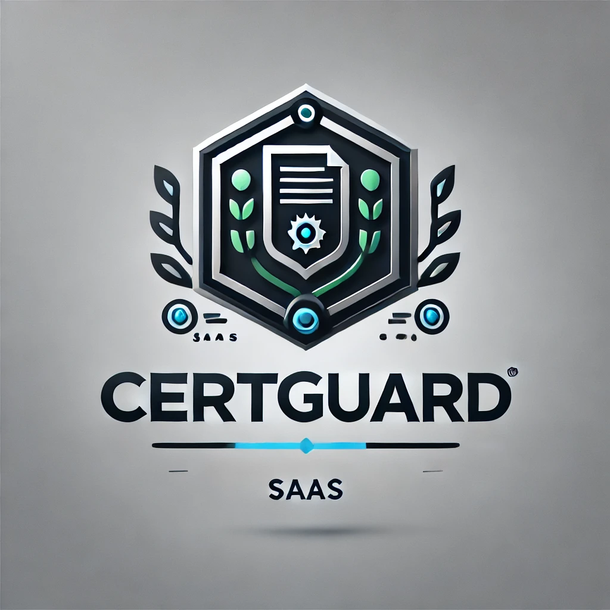

# CertGuard

<div align="center">
  
  <h3>Plataforma de Gerenciamento de Certificados Digitais</h3>
</div>

## Descrição

CertGuard é uma plataforma SaaS baseada em nuvem projetada para gerenciamento robusto de controle de acesso de entidades legais e fluxos de trabalho simplificados para certificados digitais.

## Recursos Principais

- **Gestão de Certificados**: Suporte completo para diferentes tipos de certificados (A1 e A3) e entidades (PF e PJ).
- **Controle de Acesso**: Sistema refinado de políticas de acesso para certificados.
- **Gestão de Usuários**: Administração de usuários com grupos e permissões.
- **Agendamentos**: Planejamento de ações de certificados com agendamentos personalizáveis.
- **Auditoria**: Sistema completo de logs para rastrear todas as ações importantes.

## Tecnologias

- **Frontend**: React, TypeScript, TailwindCSS, shadcn/ui
- **Backend**: Node.js, Express
- **Banco de Dados**: PostgreSQL (opcional) ou armazenamento em memória para desenvolvimento
- **Autenticação**: Sistema personalizável de autenticação e autorização

## Guia de Início Rápido

### Pré-requisitos

- Node.js (versão 18+)
- npm ou yarn

### Instalação

1. Clone este repositório:
   ```bash
   git clone https://github.com/widudu05/CertGuard.git
   cd CertGuard
   ```

2. Instale as dependências:
   ```bash
   npm install
   ```

3. Inicie o servidor de desenvolvimento:
   ```bash
   npm run dev
   ```

4. Acesse a aplicação em:
   ```
   http://localhost:5000
   ```

## Documentação

Para mais informações sobre uso, configuração e arquitetura, consulte a documentação na pasta `/docs`.

## Licença

Este software é mantido sob licença proprietária. © 2025 CertGuard.